<picture>
  <source media="(prefers-color-scheme: dark)" srcset="./assets/dark.svg">
  <source media="(prefers-color-scheme: light)" srcset="./assets/light(3).svg">
  
</picture>

 

## Hello! I'm Hanushree M 👋

Passionate about building AI-powered solutions and impactful web applications. I love turning ideas into real-world products through technology, research, and creativity.

- 🎓 **B.E. Computer Science and Engineering** — Nandha Engineering College · Batch 2026
- 📍 Tamil Nadu, India
- 💼 Full Stack Engineer @ Nandha InfoTech · AI Intern @ Infosys Springboard
- 🔭 Currently building: intelligent agents, computer vision systems, and generative AI projects
- 🌱 Learning: advanced LLM fine-tuning, RAG pipelines, and distributed systems

---

## 🛠️ Tech Stack

**AI / ML**
`Python` `PyTorch` `TensorFlow` `OpenCV` `YOLOv8` `LLMs` `RAG` `Google Gemini` `GANs` `LSTM` `NLP` `Transfer Learning`

**Full-Stack**
`MERN` `React` `Node.js` `Django` `HTML` `CSS` `JavaScript`

**Data & Cloud**
`MySQL` `MongoDB` `Version Control` `SDLC`

---

## 🚀 Featured Projects

### 🎨 Kolam Generation Seed
> Generative AI project that recreates traditional Kolam patterns using deep learning — combining GANs and Autoencoders to learn and generate stroke patterns.

---

### 🛡️ SRI — Sentinel Reconnaissance Intelligence
> AI-powered surveillance and reconnaissance intelligence system using YOLOv8, NLP, and Computer Vision for national security applications.

---

### 🏙️ Smart City — Adaptive Traffic Optimization
> AI-driven intelligent agent for crowd safety, mobility, and inclusive assistance in real time.

---

### 🤖 Mathchatbot
> Generative AI math assistant powered by LLMs, providing step-by-step mathematical reasoning and solutions.

---

## 💼 Experience

| Role | Organisation |
|---|---|
| Full Stack Engineer | Nandha InfoTech |
| Artificial Intelligence Intern | Infosys Springboard |

---

## 📊 GitHub Stats

  
  

  

---

## 🔗 Connect

  
  &nbsp;
  

---

  <code>const betterTomorrow = () => { return learn() + build() + impact(); }</code>

  

